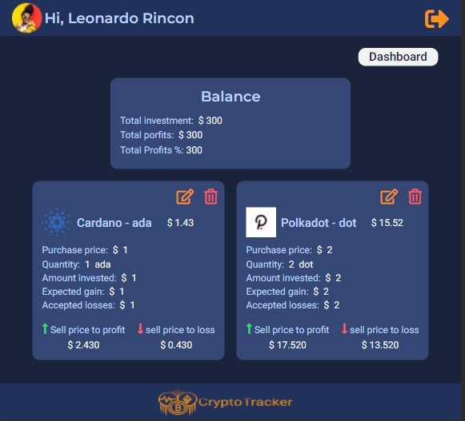
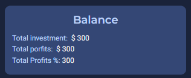
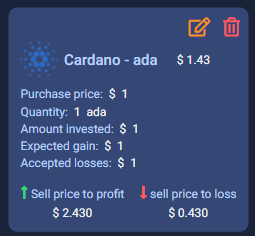
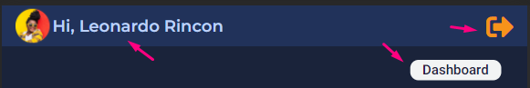

# CryptoTracker.

CryptoTracker is a web application that you can use to keep track of your investments in cryptocurrency, we have elistadas the top 20 of the cryptos with the largest Market Cap.

## Home

In our Home you will find the navigation menu where you can log in or Sign Up depending on the case, description of the app and our team.
<br/>
<br/>


<br/><br/>

## Sign UP

In our registration system does not require demaciados data, once you process your information you can have an account in our application and redirect you to make your login


<br/><br/>

# Login

Once your registration has been successful, our application redirects you to this page so that you can make your login, with the data previously used.
<br/><br/>


<br/><br/>

# 2fa (two factor authentication )

We have a two factor authentication to ensure that only you can enter your created account, this 6-digit code will reach your email registered in the application.
<br/><br/>


<br/><br/>

# Dashboard

when you have already echo login and validated with 2fa you can enter our dashboard where you will find listed the 20 cryptos with the largest market cap.
<br/><br/>


<br/><br/>

## Add cryptos to your portfolio

Within the dashboard you will find that each cryptocurrency is in a card with the most essential information such as price, market cap and its variations in the last 24H, you will also find the "plus" icon that will allow you to open a modal and add the coin to your tracking portfolio.
<br/><br/>


<br/><br/>

## Modal to add

With the modal that is displayed in the card that is in the dashboard you can add this coin to your portfolio by completing the requested data all the data are mandatory. in expected gain and lost allowed will help you to the portfolio card give you the prices at which you must sell to come out with profits or lost as the case may be.
<br/><br/>


<br/><br/>

# Porfolio

On this page you can find all coins in which you have invested and selected from the dashboard
<br/><br/>


<br/><br/>

## Card Balance

In the balance card you can find the total of your investments and the current state of them, these in profits or losses according to your money invested
<br/><br/>


<br/><br/>

## Crad Cryptocurrency

In the cryptocurrency card you will find the following data: coin, current price of the coin, and especially according to your expected profit or expected loss throws you in real time the corresponding sale price to come out with profits or losses in the investment

In addition to the edit and delete buttons so that you can update your purchase or delete the record if you have already left said investment in the coin

<br/><br/>


<br/><br/>

Finally you will find the header in which you will have a button that will take you to the dashboard and visiversa according to the case of the page in which you are, also with the logout icon you can end your session in the application.
<br/><br/>


<br/><br/>

<a href='https://github.com/CryptoTracker-Platzi-Master/Frontend'>Link to repository</a>

<a href='https://www.notion.so/CryptoTracker-bbdac7a200d44a1aa5c74c8bcd156851'>Link to Documentation</a>

<a href='https://cryptotracker-master.netlify.app/'>Link public</a>
<br/><br/>

## Dependencies

- Testing-library/jest-dom: version - 5.11.4
- Testing-library/react: version - 11.1.0
- Ttesting-library/user-event: version - 12.1.10
- axios: version - 0.21.1
- ReactJS: version - 17.0.2
- react-dom: version - 17.0.2
- react-router-dom: version - 5.2.0
- react-script": version - .0.3
- sass": version - 1.34.1

### Clone the project with SSH

```
git clone "git@github.com:CryptoTracker-Platzi-Master/Frontend.git"
```

- Deploy the project locally: `yarn start`
- switch to production mode: `yarn build`
- Run the project tests: `yarn test`
