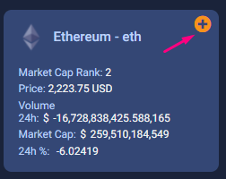

# CryptoTracker.

CryptoTracker is a web application that you can use to keep track of your investments in cryptocurrency, we have elistadas the top 20 of the cryptos with the largest Market Cap.

## Home

In our Home you will find the navigation menu where you can log in or Sign Up depending on the case, description of the app and our team.
 
 

  

## Sign UP

In our registration system does not require demaciados data, once you process your information you can have an account in our application and redirect you to make your login

  

# Login

Once your registration has been successful, our application redirects you to this page so that you can make your login, with the data previously used.
  

  

# 2fa (two factor authentication )

We have a two factor authentication to ensure that only you can enter your created account, this 6-digit code will reach your email registered in the application.
  

  

# Dashboard

when you have already echo login and validated with 2fa you can enter our dashboard where you will find listed the 20 cryptos with the largest market cap.
  

  

## Add cryptos to your portfolio

Within the dashboard you will find that each cryptocurrency is in a card with the most essential information such as price, market cap and its variations in the last 24H, you will also find the "plus" icon that will allow you to open a modal and add the coin to your tracking portfolio.
  

  

## Modal to add

With the modal that is displayed in the card that is in the dashboard you can add this coin to your portfolio by completing the requested data all the data are mandatory. in expected gain and lost allowed will help you to the portfolio card give you the prices at which you must sell to come out with profits or lost as the case may be.
  

  
